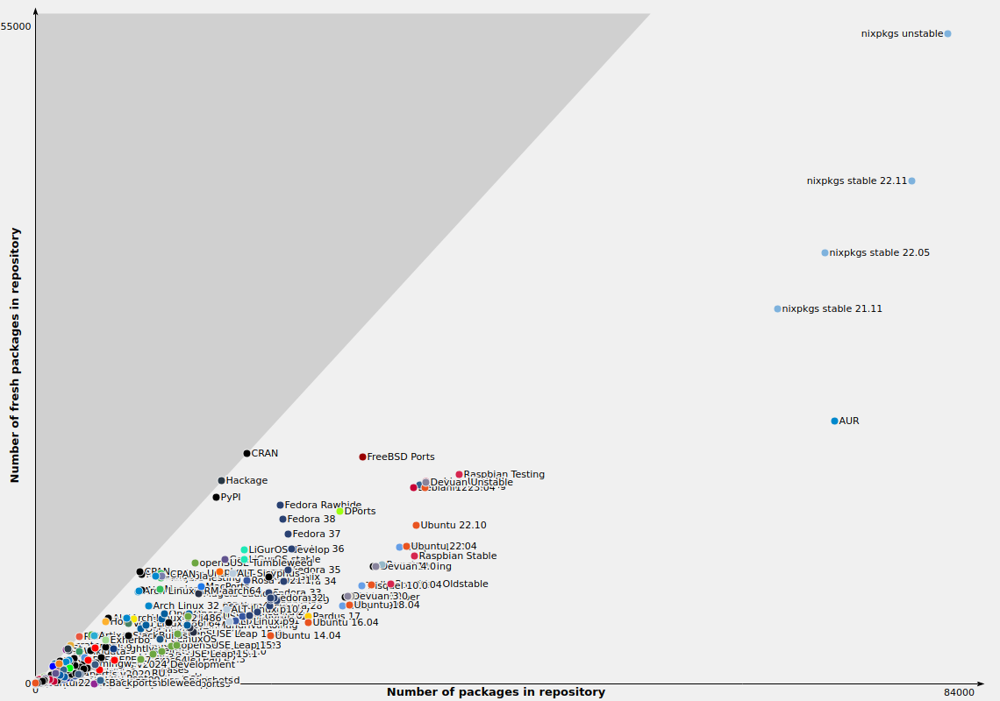

#+startup: beamer
#+Title: Nix for science and fun
#+AUTHOR: Alán F. Muñoz and Ankur Kumar
#+BEAMER_HEADER: \institute{Imaging Platform, Broad Institute of Harvard and MIT}
#+OPTIONS: toc:nil num:nil date:nil tex:t title:nil author:t email:nil ^:nil
#+LATEX_CLASS: beamerposter
#+BEAMER_THEME: gemini
#+BEAMER_COLOR_THEME: gemini
#+LATEX_HEADER: \usepackage{svg}
#+latex_header: \usepackage{xcolor}
#+LATEX_HEADER: \usepackage{minted}
#+LATEX_HEADER: \definecolor{bg}{rgb}{0.95,0.95,0.95}
# #+bibliography: ../local-bib.bib
# #+cite_export: csl

* Footer (Optional)                                                  :ignore:
# #+BEAMER_HEADER: \footercontent{
# #+BEAMER_HEADER:  \href{https://github.com/afermg/2024\_10\_i2k\_poster\_flashtalk/blob/main/poster.pdf}{github.com/afermg/2024\_10\_i2k\_poster\_flashtalk/blob/main/poster.pdf} \hfill
# #+BEAMER_HEADER:  I2K 2024, Milan, Italy \hfill
# #+BEAMER_HEADER:  \href{mailto:amunozgo@broadinstitute.org}{amunozgo@broadinstitute.org}}
# # (can be left out to remove footer)

* Logo (Optional)                                                    :ignore:
# use this to include logos on the left and/or right side of the header:

# #+BEAMER_HEADER: \logoleft{\includegraphics[height=12cm]{../figs/qr_hub.png}}
#+BEAMER_HEADER: \logoright{\includegraphics[height=3cm]{../logos/broad_logo.png}}

# # # ====================
# # # Body
# # # ====================

* @@latex:@@ :B_fullframe:
:PROPERTIES:
:BEAMER_ENV: fullframe
:END:

** @@latex:@@ :BMCOL:
:PROPERTIES:
:BEAMER_col: 0.33
:END:
*** Abstract
One of the biggest challenges for the biological sciences is the replication crisis we face. In addition to inherent biological noise and ever-growing datasets, limited focus on reproducibility of computational processes and their associated results hinders novel discoveries. Improving the reliability and efficiency of scientific research will increase the credibility of current and future scientific literature and accelerate discovery. While there have been improvements in recent years, current technologies fall short of principally solving the problem of software reproducibility. Nix is a framework for software deployment that warrants correct resolution of dependency trees to provide fully reproducible and deterministic packages and environments.

*** What is Nix?
\vspace*{1cm}
#+begin_example
I am unable to re-run your analysis to verify the reported results.

- Reviewer 2
#+end_example

#+ATTR_LATEX: :width 0.6\linewidth
[[../figs/nix_trinity.png]]

*** Problem: Dependency resolution\hfill Solution:
\vspace*{1cm}
Most package managers and workflow tools are not theoretically sound to provide reproducibility guarantees.

**** Problem:                                                      :BMCOL:
:PROPERTIES:
:BEAMER_col: 0.5
:END:

#+begin_src shell :exports code :eval no
# Package management with APT on Ubuntu
# Install git system wide
apt install git

# Install CellProfiler via pip
pip install cellprofiler
#+end_src 

- Packages are installed system wide
- Version specification is only possible for the top level of the dependency tree
- Building packages from source is usually not supported or not encouraged
  
**** Solution:                                                     :BMCOL:
:PROPERTIES:
:BEAMER_col: 0.5
:END:
#+begin_src shell :exports code :eval no
  # Create temporary shell
  # with nixpkgs' git
  nix shell nixpkgs#git
   
  # Runs cellprofiler 
  nix run github:Cellprofiler/
  Cellprofiler#cellprofiler
#+end_src
- Packages are always isolated and cannot be accessed outside the temporary shell
- Version specification is possible of the entire dependency tree
- Packages can be built from source and have first class support
*** Problem: Dependency conflicts\hfill Solution:
**** Problem:                                                      :BMCOL:
:PROPERTIES:
:BEAMER_col: 0.5
:END:

#+begin_src shell
# Install pytorch with cuda 11
apt install cuda-toolkit-11-8

# Install pytorch with cuda 12
apt install cuda-toolkit-12-8
#+end_src

- CUDA is installed system wide
- Cannot install two versions of cuda at the same time without manual symlink and env vars management

**** Solution:                                                     :BMCOL:
:PROPERTIES:
:BEAMER_col: 0.5
:END:
#+begin_src shell :exports code :eval no
  # Create temporary shell with:
  # cuda 11
    nix shell nixpkgs#cudaPackages_11.cudatoolkit
  
  # cuda 12
    nix shell nixpkgs#cudaPackages_12.cudatoolkit
#+end_src

- Cuda is not installed system-wide
- Multiple cuda versions can coexist without further environment management
*** Problem: Environment replication\hfill Solution:
**** Problem:                                                      :BMCOL:
:PROPERTIES:
:BEAMER_col: 0.5
:END:
#+begin_src shell :exports code :eval no
  conda env create -f env.yaml
#+end_src

System wide dependencies cannot be easily shared without containerization.
- Conda can manage some system libraries, but not all
\vspace*{100cm}
  
**** Solution:                                                     :BMCOL:
:PROPERTIES:
:BEAMER_col: 0.5
:END:
#+begin_src shell :exports code :eval no
  nixos-shell --flake github:leoank/neusis#oppy
#+end_src

\vspace*{100cm}
  
** @@latex:@@ :BMCOL:
:PROPERTIES:
:BEAMER_col: 0.3
:END:
*** Problem: Projects with different requirements\hfill Solution:
On most operating systems, packages are installed system wide and are not isolated.
This makes it very challenging to work with projects requiring older or newer version of dependencies without breaking the rest of the system.
***** Normal systems:
:PROPERTIES:
:BEAMER_ENV: block
:BEAMER_col: 0.35
:END:
#+begin_src mermaid :file ../figs/conflict.png :theme forest :exports results :scale 3
graph LR;  
  Y2[(Y v1)] -- OK --> A[(A)]
  Y1[(Y v2)] -- OK --> B[(B)]
  Y1 -- OR --> Y2  
  Y2 -. Error .-> B[(B)]
  Y1 -. Error .-> A
#+end_src

***** Nix:
:PROPERTIES:
:BEAMER_ENV: block
:BEAMER_col: 0.35
:END:

#+begin_src mermaid :file ../figs/nix_independent.png :theme forest :exports results :scale 3
graph LR;  
  S[(/nix/store)]  --> Y1
  S --> Y2  
  Y1[(Y v1)] --> A[(A)]
  Y2[(Y v2)] --> B[(B)]
#+end_src

*** Benefits
**** 100k+ packages as of April 2025

# [[../figs/top_repos.png]]

**** Consistent environments across different machines and architectures
#+begin_src mermaid :file ../figs/multiple_machines.png :exports results :scale 3 :theme neutral
graph TD;
  C[Config]  --> N1[(NixOS Server 1)]
  C --> N2[(NixOS Server 2)]
  C --> M[(MacOS + Nix)]
  C --> L[(Linux + Nix)]
#+end_src

**** Reliably package and deploy software
 #+begin_src nix :exports code :eval no
   # file.nix
      {inputs}:
      {
        output = buildPackage{
          unpackPhase = {...};
          buildInputs = {...};
          buildPhase = {...};
          installPhase = {...};
        };
      } 
   # $ nix build file.nix
   # -> /nix/store/is2vyv9sxn4w9rrgqxg9qhlcf3slfv34-emacs-30.1.drv
   # -> /nix/store/is2vyv9sxn4w9rrgqxg9qhlcf3slfv34-emacs-30.1
 #+end_src
 
\vspace*{100cm}
** @@latex:@@ :BMCOL:
:PROPERTIES:
:BEAMER_col: 0.3
:END:
*** Generate entire pipelines with multiple languages and frameworks
This is useful for updating figures and re-run entire multi-language pipelines becomes a non-issue.

#+begin_src shell :eval no
#!/usr/bin/env nix-shell
#! nix-shell -i bash --pure
#! nix-shell -I nixpkgs=https://github.com/NixOS/nixpkgs/archive/205a5.tar.gz
#! nix-shell -p bash wget awk R rPackages.Seurat uv

  wget https://remote_data.com/files_of_interest.txt

  awk -f preprocessing_script.awk files_of_interest.txt > preprocessed_data

  Rscript script.R preprocessed_data > new_data
  for pyscript in python_scripts*.py; do
      uv run $pyscript new_data
  done
#+end_src

*** Demos
#+ATTR_LATEX: :width 0.7\linewidth

**** Run any package in a disposable environment
#+begin_src bash :eval no
  nix run nixpkgs#inkscape
  nix run github:Cellprofiler/Cellprofiler#cellprofiler
  export NIXPKGS_ALLOW_UNFREE=1 && nix run nixpkgs#vscode --impure
#+end_src
**** Ask us for a demonstration!
:PROPERTIES:
:BEAMER_env: exampleblock
:END:
- Setting up a specific analysis environment
- Walk me through the CellProfiler derivation
- Replicate results from a published paper
- Run a VM configured using NixOS
- Set up your package of preference
- Override a package version deep in the dependency tree
- Set up a flake for a reproducible environment
- Help me set up Nix package manager on my system

Also reproduce your entire home environment in other computers, across Linux, Windows, MacOS and Android*
*** Additional resources and links
#+ATTR_LATEX: :width 0.4\linewidth

\vspace*{100cm}
