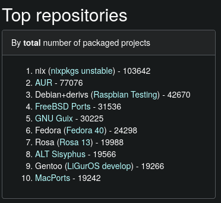

#+TITLE: Nix for Science
#+OPTIONS: ^:nil H:2 num:t toc:1
#+DATE: 2025/04/03
#+Author: Alán F. Muñoz, Ankur Kumar
#+LaTeX_CLASS: beamer
#+BEAMER_THEME: metropolis
#+BEAMER_FRAME_LEVEL: 3
#+LATEX_HEADER: \usepackage{svg}
* *Introduction*
** What is Nix?
Nix is a tool to build packages in a reproducible and deterministic way, it can be used as a package manager or as an operative system (NixOS).
#+ATTR_LATEX: :width 0.5\linewidth

** Why is it relevant to scientific workflows?
* Challenges for scientific software
** Reproducibility issues
** Dependency conflicts
** Difficulty in sharing environments
** Managing multiple projects with different requirements

* *How Nix Addresses These Challenges*
** Package management with Nix
** Reproducible builds
** Declarative configurations
** Isolated environments
** (NixOS) Versioning and rollbacks

* Benefits for Users
** Largest package repository

** Actually reproducible environments
** Easy management of complex software dependencies
** Consistent environments across different machines
** Streamlined workflow management
** Ability to track and revert software versions
* *Practical Examples and Use Cases*
** Setting up a specific analysis environment
** Sharing a computational pipeline
** Replicating results from a published paper
** Managing different versions of analysis tools
